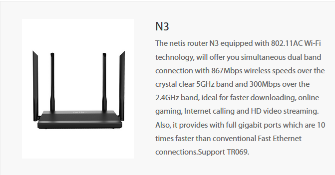

## Netis N3Mv2-V1.0.1.865 Router Blind Command Injection in ntpServIP Parameter in Time Settings

## Description

A critical security vulnerability has been identified in the Netis N3Mv2-V1.0.1.865 router firmware. This vulnerability allows malicious actors to perform a blind command injection attack through the "ntpServIP" parameter within the router's Time Settings. By manipulating this parameter, attackers can inject arbitrary OS commands, potentially leading to unauthorized access and control over the device.

## Firmware Information

- **Manufacturer's Address:** [https://www.netis-systems.com](https://www.netis-systems.com)
- **Firmware Download Address:** [https://www.netisru.com/Support/downloads/dd/1/img/865](https://www.netisru.com/Support/downloads/dd/1/img/865)

## Affected Version

- **Version: Netis N3Mv2-V1.0.1.865**

## Vulnerability Details

The vulnerability resides in the "ntpServIP" parameter within the Time Settings of the router. Attackers can manipulate this parameter to inject malicious OS commands. Due to insufficient input validation, the router processes these injected commands, potentially granting attackers unauthorized access and control over the router.

## POC Video

