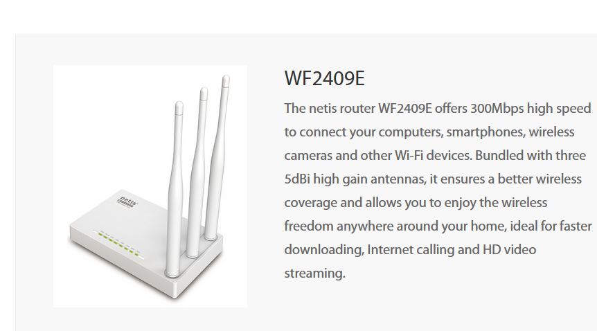
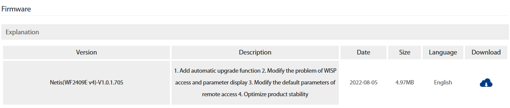
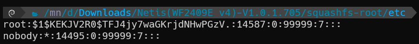

## Netis (WF2409E v4) - V1.0.1.705 was discovered to contain a hard-coded password for root stored in the component /etc/shadow.sample.

## Description

There is a hard-coded password for root in /etc/shadow.sample.



## Firmware Information

* Manufacturer's Address: [https://www.netis-systems.com](https://www.netis-systems.com)
* Firmware Download Address: [http://www.netis-systems.com/Support/downloads/dd/1/img/758](http://www.netis-systems.com/Support/downloads/dd/1/img/758)

## Affected Version

**Version: Netis (WF2409E v4) - V1.0.1.705**



## Vulnerability Details



```
root:$1$KEKJV2R0$TFJ4jy7waGKrjdNHwPGzV.:14587:0:99999:7:::
nobody:*:14495:0:99999:7:::
```

After decrypting the passwd, we obtained `root`."